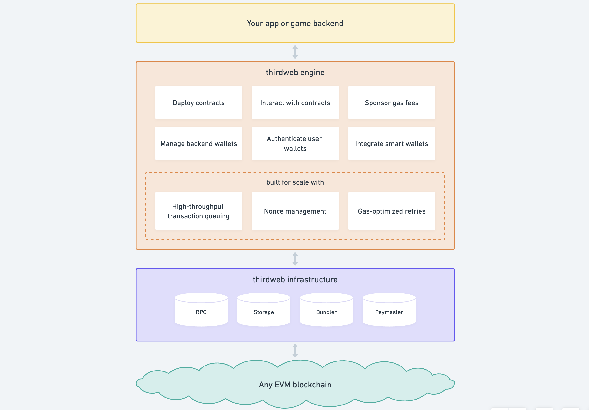

<p align="center">
    <br />
    <a href="https://thirdweb.com">
        </a>
    <br />
</p>

<h1 align="center"><a href='https://thirdweb.com/'>thirdweb</a> Engine</h1>

<p align="center">
    <a href="https://discord.gg/thirdweb">
        
    </a>
</p>

<p align="center"><strong>The most powerful backend engine for web3 apps.</strong></p>

## Table of contents

- [Introduction](#introduction)
- [Getting started](#getting-started)
  - [Setup environment variables](#setup-environment-variables)
  - [Run the server](#run-the-server)
  - [Using the server](#using-the-server)
- [Local development](#local-development)
- [User guide](#user-guide)
- [Documentation](#api-documentation)
- [Contributing](#contributing)

## Introduction

thirdweb engine is a backend server that provides a HTTP interface to interacting with any smart contract on any evm chain. Engine handles creating and managaging backend wallets, enabling high throughput with automatic nonce and gas management.

The high level functionality of thirdweb engine:

<!-- Source: https://whimsical.com/engine-architecture-2G6rXEvUM2HFmVwKxPWyzS -->


- Create & transact with **backend wallets** (Local, AWS KMS, Google KMS, etc.)
- High reliability transaction execution with **wallet nonce management**, **automatic transaction retrying** and **gas mangement**
- Deploy and interact with [erc-4337](https://eips.ethereum.org/EIPS/eip-4337) smart wallets, handle session keys & sending user operations
- Deploy published smart contracts (any EVM chain)
- Read, write and interact with smart contracts (any evm chain)
- Run in your own cloud or use the thirdweb managed service
- Fine-grained user access controls & wallet based client-side authentication [Coming Soon]
- Gasless relayer, bundler, and paymaster for gasless transactions [Coming Soon]

This project is in `alpha` - if you're looking for specific features & or want to give feedback, reach out to us!

## Requirements

1. Docker
2. Postgres DB

## Getting started

### Setup environment variables

Set these environment variables to get started.

| Variable Name             | Description                                                                                                   |
| ------------------------- | ------------------------------------------------------------------------------------------------------------- |
| `THIRDWEB_API_SECRET_KEY` | Create an API KEY on thirdweb Dashboard and copy the SecretKey.                                               |
| `POSTGRES_CONNECTION_URL` | Postgres connection string, format: postgresql://[user[:password]@][host][:port][/dbname][?param1=value1&...] |

### Run the server

Run the server using Docker with the following command.

```
docker run \
    -e THIRDWEB_API_SECRET_KEY="<your-api-secret-key>" \
    -e POSTGRES_CONNECTION_URL="<your-connection-url>" \
    -p 3005:3005 \
    thirdweb/engine:latest
```

### Using the server

- Every request to the server requires an authentication token for admin actions use the thirdweb SecretKey. Use the `Authorization` Header to set the value shown below:
  - `Authorization: Bearer <thirdweb SecretKey>`
- Every write request to the server also requires the `x-backend-wallet-address` header to specify which admin wallet to send a transaction with. Use the following format to set this header:

  - `x-backend-wallet-address: 0x3ecdbf3b911d0e9052b64850693888b008e18373`

- Here's the link to the [full API reference](https://redocly.github.io/redoc/?url=https://demo.web3api.thirdweb.com/json), or in development mode, go to the server root url to see the reference.

## User Guide

View all end-points details (Open API Specification) : [User Guide](./docs/1-user-guide.md)

### Webhook Guide

View the webhook guide for setting up webhooks for your app: [Webhook Guide](./docs/3-webhook-guide.md)

## API Reference

View all end-points details (Open API Specification) : https://web3-api-akbv.chainsaw-dev.zeet.app

## Contributing

We welcome contributions from all developers, regardless of experience level. If you are interested in contributing, please read our [Contributing Guide](./docs/addons/contributing.md) where you'll learn how the repo works, how to test your changes, and how to submit a pull request.

## Community

The best place to discuss your ideas, ask questions, and troubleshoot issues is our [Discord server](https://discord.gg/thirdweb).

## FAQs

A list of Frequently Asked Questions: [FAQs](./docs/addons/faqs.md)

## Security

If you believe you have found a security vulnerability in any of our packages, we kindly ask you not to open a public issue; and to disclose this to us by emailing `security@thirdweb.com`.
