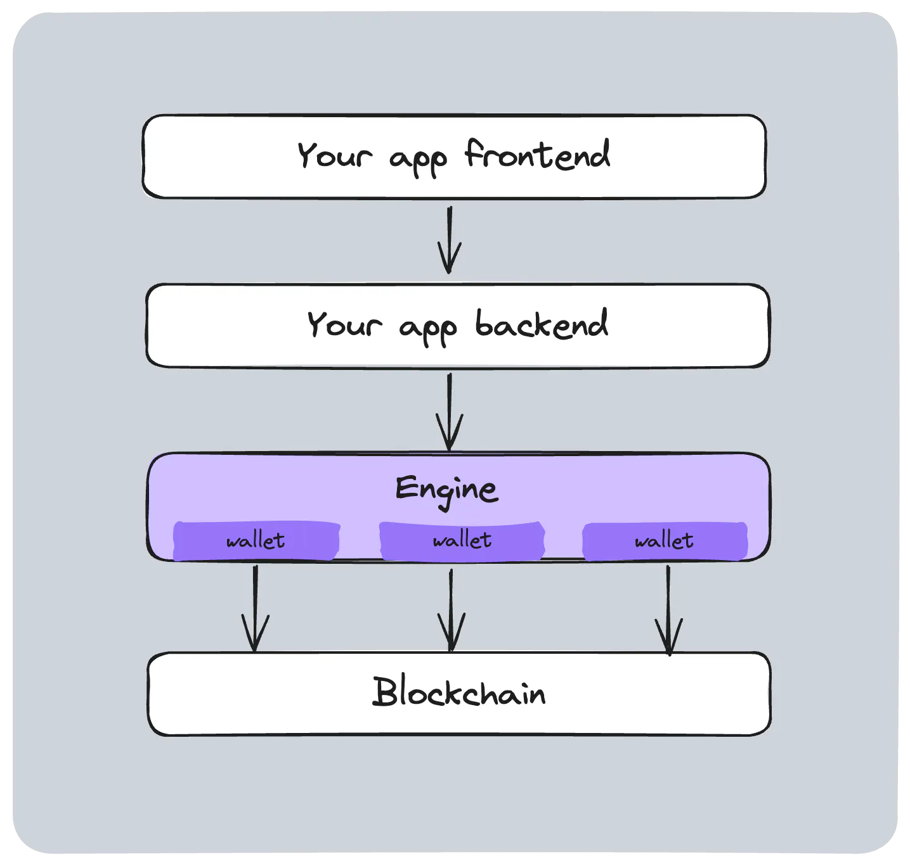

     
    
     

<h1 align="center"><a href='https://thirdweb.com/'>thirdweb</a> Engine</h1>

    
    

Engine is an open-source, backend HTTP server that provides a production-ready interface to read, write, and deploy contracts on the blockchain.

    

## Resources

- [Get Engine hosted by thirdweb](https://thirdweb.com/dashboard/engine?requestCloudHosted)
- [Documentation](https://portal.thirdweb.com/engine)
- [Self-host instructions](https://portal.thirdweb.com/engine/v2/self-host)

## Features

- 700+ transactions sent onchain per second (can fill up an EVM block!)
- Managed backend wallets (local, KMS)
- Contract calls and deployments ([all EVM blockchains](https://thirdweb.com/chainlist) + private subnets)
- Gas-optimized retries, gas ceilings, and timeouts
- Smart account support with session tokens
- Gasless transactions with relayers
- Wallet and contract webhooks
- And [much more!](https://portal.thirdweb.com/engine)

## Setup

- [Get Engine hosted and managed by thirdweb](https://thirdweb.com/dashboard/engine?requestCloudHosted)
- [Self-host Engine for free](https://portal.thirdweb.com/engine/self-host)
- Other deployment options
  - [Deploy on Railway](https://railway.app/template/fcEVay)

## Contributing

We welcome your contributions! See [how to contribute](./contributing.md).

## We're hiring!

[thirdweb is hiring engineers](https://careers.thirdweb.com/)! (Contributing is always a good way to get our attention. 😉)

## Get in touch

- Community: [Join us on Discord](https://discord.gg/thirdweb)
- Support: <https://thirdweb.com/support>
- Twitter: [@thirdweb](https://twitter.com/thirdweb)
- Report a vulnerability: security@thirdweb.com
